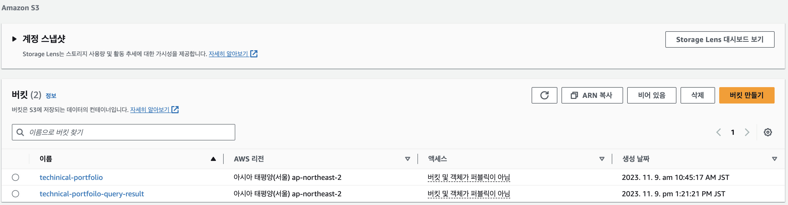

# AWS
프로젝트 초기에는 데이터의 양이 적어 데이터 조회 속도가 빨랐지만, 시간이 지남에 따라 데이터가 많아져 InfluxDB의 성능이 크게 감소했습니다. 많은 양의 데이터를 보다 효과적으로 조회하고 저장, 관리하기 위해 [Python Code](../src/src.md)를 통해 압축률이 좋은 Apache Parquet로 압축한 후 AWS S3에 업로드, AWS Glue를 통해 Parquet를 읽어서 AWS Athena를 통해 Query를 수행합니다. AWS를 활용하는 부분을 자동화하기 위해 AWS Cli를 활용했으며, Shell Script로 저장했습니다. 스크립트 활용 전에 AWS 계정을 생성, IAM을 통해 key와 secret key를 발급 받아 환경 설정을 수행해야합니다. 또한 생성된 IAM은 AWS S3, Glue, Athena와 관련된 권한을 가지고 있어야합니다.

### AWS CLI 설치 후 Configure </br>
```aws_cli.sh``` : AWS CLI 설치 </br>
```aws_auto_complete.sh``` : AWS CLI 자동 완성 설정 </br>

# AWS S3
```s3.sh``` : AWS S3 Bucket 생성 및 Parquet Upload </br>

### 버킷 생성 결과

### 업로드 결과

--
# AWS Glue
```glue.sh``` : AWS Glue 크롤러,DB 생성 </br>
### Glue Database 생성 결과

### Glue Crawler 생성 및 싱행 성공

--
# AWS Athena
```athena.sh``` : 질의 실행 및 쿼리 결과 다운로드 </br>
### Athena Query

### Query 수행 결과 S3에 csv로 저장

### [Query 결과 CSV](../data/query-result/3454a992-50d9-4685-ab58-9ae475fae183.csv)